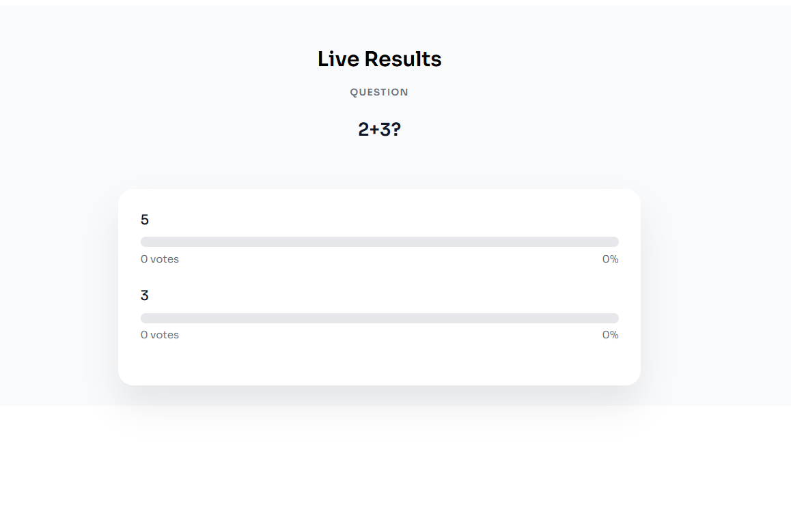
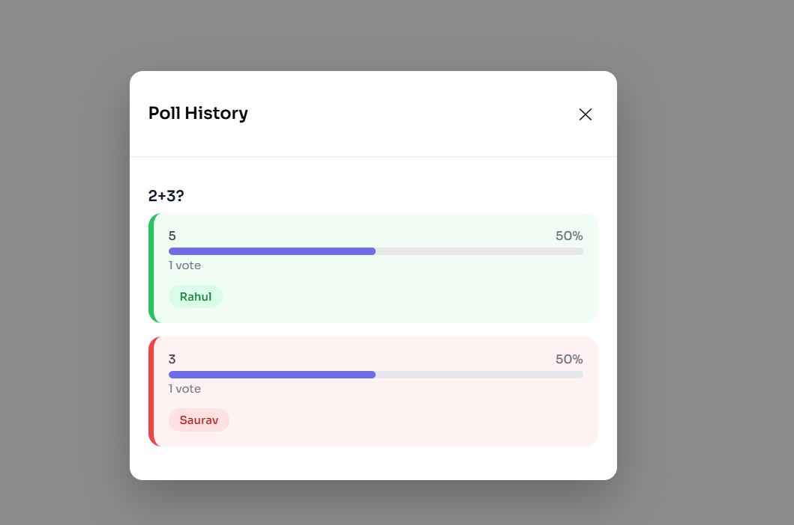
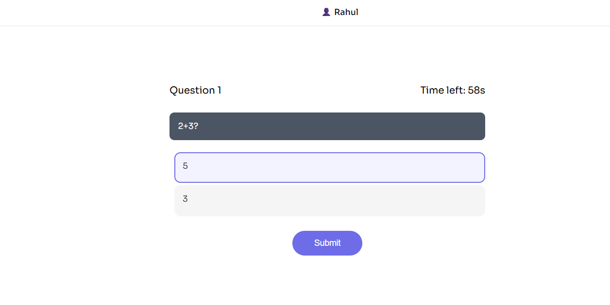
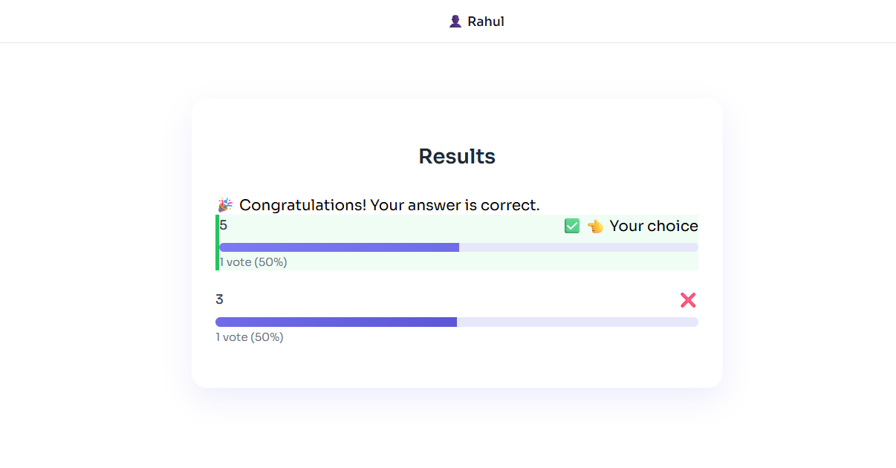
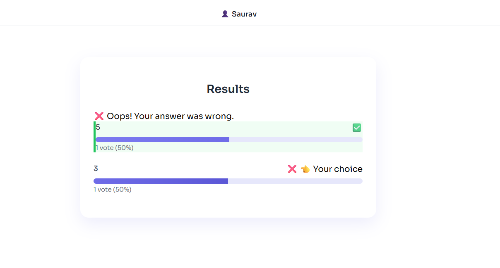

# 🗳️ Live Polling & Assessment Platform

A real-time live polling and assessment web application built for interactive classrooms, interviews, and training sessions.  
The platform allows teachers to conduct live polls and analyze student responses instantly using WebSockets.

---

## 🚀 Features

### 👨‍🏫 Teacher Features
- Create live polls with multiple options
- Mark correct answers for assessment-based questions
- View live voting progress in real time
- See **which student voted for which option**
- Automatic evaluation of correct and wrong answers
- Detailed poll history with:
  - Question
  - Options
  - Vote count and percentage
  - Student-wise vote details
- Kick students if required
- Live chat and student question panel

---

### 👩‍🎓 Student Features
- Join poll using name (no authentication required)
- Submit answers in real time
- View selected answer immediately
- See final result after poll ends
- Waiting screen between polls
- Participate in live chat

---

## 🖼️ Screenshots

### 🧑‍🏫 Teacher Dashboard


### 📊 Live Results (Teacher View)


### 🕒 Poll History with Student Votes


### 👩‍🎓 Student Poll View


### 🧾 Student Result View



> 📌 Screenshots are stored inside the `/screenshots` folder.

---

## 🛠️ Tech Stack

### Frontend
- React.js
- Context API
- Socket.IO Client
- CSS

### Backend
- Node.js
- Express.js
- Socket.IO

---

## ⚙️ Architecture Highlights
- Real-time communication using Socket.IO
- Event-driven backend architecture
- Centralized state management using React Context
- Backend-controlled correctness evaluation
- Poll history maintained during session lifecycle

---

## 🧪 How to Run Locally

### 1️⃣ Clone the repository
```bash
git clone https://github.com/oiiamsaurav78/live-polling.git
cd live-polling
2️⃣ Start Backend
bash
Copy code
cd server
npm install
npm start
3️⃣ Start Frontend
bash
Copy code
cd client
npm install
npm run dev
🌟 Future Enhancements
Student performance analytics

Database integration (MongoDB)

Authentication for teachers and students

Export poll results (CSV / PDF)

Mobile responsive UI

📌 Resume Description
Live Polling & Assessment Platform

Built a real-time polling system using React, Node.js, and Socket.IO

Enabled teacher-side visibility into individual student responses

Implemented automatic answer evaluation and poll history tracking

Designed scalable event-driven WebSocket architecture

👤 Author
Saurav Kumar
B.Tech – Electrical & Electronics Engineering
NIT Andhra Pradesh

📧 Email: oiiamsaurav@gmail.com
🔗 Portfolio: https://portfolio-eight-psi-50.vercel.app/
🔗 GitHub: https://github.com/oiiamsaurav78

⭐ If you find this project useful, consider giving it a star!

yaml
Copy code

---

## ✅ STEP 2: Add screenshots folder

In VS Code:

live-polling/
├── client/
├── server/
├── screenshots/
│ ├── teacher-dashboard.png
│ ├── live-results.png
│ ├── poll-history.png
│ ├── student-poll.png
│ └── student-result.png
└── README.md

yaml
Copy code


